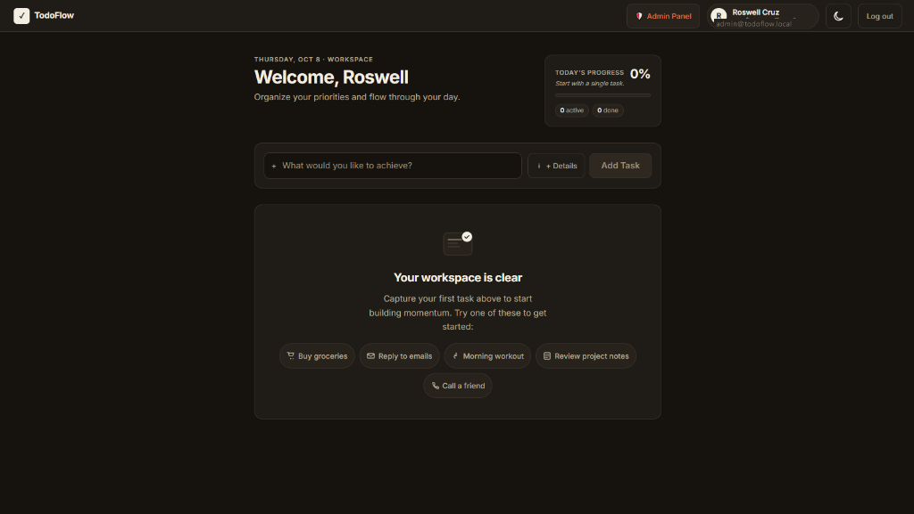
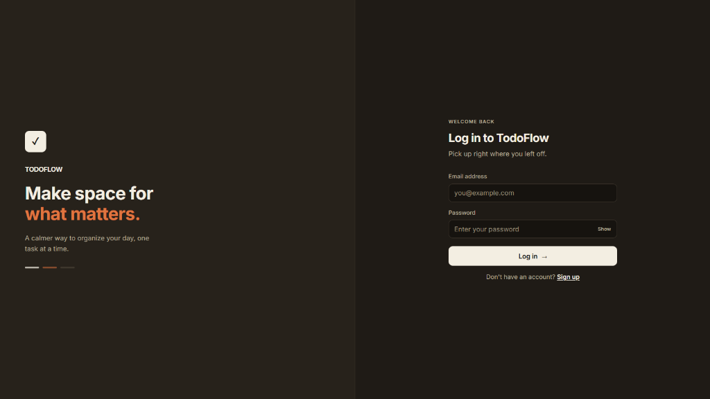
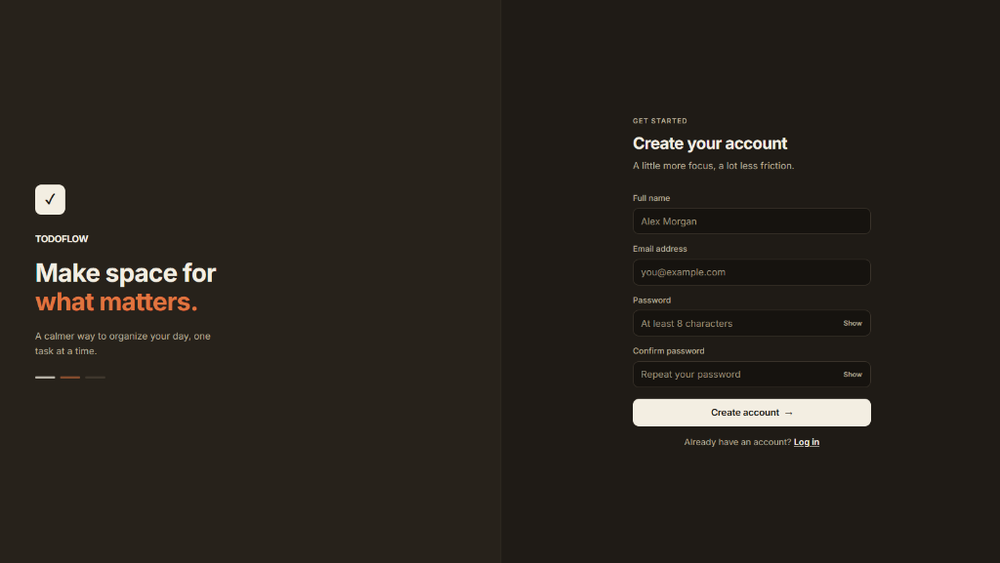

<div align="center">

# ⚡ TodoFlow

**Modern, Secure, High-Performance Full-Stack Task Orchestration & Management Platform**

[](https://react.dev/)
[](https://vitejs.dev/)
[](https://expressjs.com/)
[](https://www.prisma.io/)
[](https://neon.tech/)
[](LICENSE)

<p align="center">
  <a href="#-app-preview">Preview</a> •
  <a href="#-features">Features</a> •
  <a href="#-system-architecture">Architecture</a> •
  <a href="#-tech-stack">Tech Stack</a> •
  <a href="#-getting-started">Getting Started</a> •
  <a href="#-api-documentation">API Reference</a> •
  <a href="#-admin-command-center">Admin Suite</a> •
  <a href="#-security">Security</a> •
  <a href="#-deployment">Deployment</a>
</p>

</div>

---

## 📸 App Preview

<div align="center">

### 🖥️ Workspace Dashboard
*Clean, distraction-free workspace with quick starters, priority tags, and real-time completion analytics.*

<br/>



<br/><br/>

### 🔐 Seamless Onboarding & Authentication
*Minimalist split-screen authentication experience featuring custom dark/light theme integration.*

<br/>

<table align="center" width="95%">
  <tr>
    <td align="center" width="50%">
      <sub><b>Sign In</b></sub><br/><br/>
      
    </td>
    <td align="center" width="50%">
      <sub><b>Create Account</b></sub><br/><br/>
      
    </td>
  </tr>
</table>

</div>

## 🌟 Overview

**TodoFlow** is a production-grade full-stack productivity web application designed to help individuals and teams organize daily workflows effortlessly. Built with zero runtime bloat, it pairs a blisteringly fast **React 19 + Vite 8** single-page application with a robust **Express 5** backend powered by **Prisma 7** and **Neon Serverless PostgreSQL**.

From interactive priority tagging, overdue task tracking, and search filters to an enterprise-style **Admin Command Center** with Role-Based Access Control (RBAC), TodoFlow provides a complete end-to-end task management experience.

---

## ✨ Features

### 👤 User Task Management
- **Full Task Lifecycle (CRUD)**: Create, view, update, toggle completion status, and delete tasks with instant UI updates.
- **Priority & Categorization**: Organize tasks with priority levels (`low`, `medium`, `high`) and custom categories (`general`, `work`, `personal`, `urgent`).
- **Due Date & Overdue Tracking**: Deadlines with real-time indicators highlighting overdue obligations.
- **Instant Search & Multi-Column Sorting**: Filter tasks dynamically by status, category, priority, or search query. Sort by creation date, due date, priority, or title.
- **Productivity Telemetry**: Live metrics dashboard tracking total tasks, active tasks, completed count, high-priority counts, and calculated completion rate.
- **Bulk Cleanup**: Quickly clear all completed tasks in one click.

### 🎨 Design & User Experience
- **Adaptive Theme System**: Seamless `light`, `dark`, and `system` theme support with zero Flash of Unstyled Content (FOUC).
- **Vanilla CSS Design Tokens**: Custom design system crafted without heavy utility frameworks for ultra-light asset delivery.
- **Zero-Dependency SPA Routing**: Native History API router ensuring rapid route transitions and low bundle overhead.
- **Responsive & Accessible**: Fully optimized for mobile, tablet, and desktop viewports with clean SVG iconography.

### 🛡️ Enterprise Security & Auth
- **JWT-Based Authentication**: Stateless authentication with signed 7-day tokens and automatic session reconciliation.
- **Password Protection**: Passwords salted and hashed with `bcrypt` (10 rounds).
- **Brute-Force Rate Limiting**: Dedicated rate limiting on authentication routes (10 attempts per 15-minute window).
- **Security Hardened**: Protected with `helmet` HTTP headers, strict request size boundaries (20 KB), and CORS origin allowlisting.
- **Strict Data Ownership**: Every task operation is securely scoped by `userId` to prevent unauthorized cross-tenant data access.

### 👑 Admin Command Center
- **Role-Based Access Control (RBAC)**: Distinguishes between `USER` and `ADMIN` roles across both the client routing and backend API.
- **Platform Analytics**: Global overview of registered users, active accounts, aggregate task volume, and platform completion rates.
- **User Lifecycle Governance**: View user profiles and their personal task histories, toggle account status (`active` / `inactive`), or permanently remove users.
- **Global Task Moderation**: Audit and delete inappropriate or deprecated tasks platform-wide.

---

## 📐 System Architecture

```text
┌────────────────────────────────────────────────────────────────────────┐
│                              CLIENT (SPA)                              │
│         React 19 • Vite 8 • CSS Tokens • Native History Router         │
│                                                                        │
│   ┌─────────────────────┐   ┌─────────────────┐   ┌────────────────┐   │
│   │   Auth Pages        │   │ User Dashboard  │   │ Admin Suite    │   │
│   │  (/login, /signup)  │   │  (/dashboard)   │   │   (/admin/*)   │   │
│   └──────────┬──────────┘   └────────┬────────┘   └────────┬───────┘   │
│              │                       │                     │           │
│              └───────────────────────┼─────────────────────┘           │
│                                      ▼                                 │
│                         Service Layer (Fetch API)                      │
│                    authService • todoService • adminService            │
└──────────────────────────────────────┬─────────────────────────────────┘
                                       │  JSON over HTTPS / Bearer JWT
                                       ▼
┌────────────────────────────────────────────────────────────────────────┐
│                              SERVER (API)                              │
│                      Node.js • Express 5 (REST)                        │
│                                                                        │
│   ┌────────────────────────────────────────────────────────────────┐   │
│   │  Middleware: Helmet • CORS Whitelist • RateLimit • Auth (JWT)  │   │
│   └────────────────────────────────┬───────────────────────────────┘   │
│                                    ▼                                   │
│   ┌────────────────────────────────────────────────────────────────┐   │
│   │  Controllers: authControllers • todoControllers • adminControllers │   │
│   └────────────────────────────────┬───────────────────────────────┘   │
│                                    ▼                                   │
│   ┌────────────────────────────────────────────────────────────────┐   │
│   │  Prisma ORM 7.x + @prisma/adapter-neon                         │   │
│   └────────────────────────────────┬───────────────────────────────┘   │
└────────────────────────────────────┼───────────────────────────────────┘
                                     │  WebSocket / Pooler Connection
                                     ▼
┌────────────────────────────────────────────────────────────────────────┐
│                          DATABASE (Cloud)                              │
│                     Neon Serverless PostgreSQL                         │
│                    Tables: users (Role) • todos                        │
└────────────────────────────────────────────────────────────────────────┘
```

---

## 💻 Tech Stack

| Domain | Technology | Description |
|---|---|---|
| **Frontend Framework** | **React 19** | Modern declarative UI with hooks and Context API |
| **Build Tooling** | **Vite 8** | Ultra-fast HMR and optimized production bundling |
| **Styling** | **Vanilla CSS** | Pure CSS variable token system for dark/light themes |
| **Code Quality** | **Oxlint** | High-performance Rust-based JavaScript linter |
| **Backend Runtime** | **Node.js** | CommonJS server architecture with Express 5 |
| **Database ORM** | **Prisma 7** | Type-safe query engine and schema migration workflow |
| **Database** | **Neon PostgreSQL** | Serverless relational database with connection pooling |
| **Authentication** | **JWT & Bcrypt** | Signed tokens with bcrypt password hashing |
| **Security** | **Helmet & Express Rate Limit** | HTTP headers fortification & brute-force defense |

---

## 📂 Project Structure

```text
TodoFlow/
├── client/                          # Frontend Application (React 19 + Vite 8)
│   ├── public/                      # Static web assets
│   ├── src/
│   │   ├── assets/                  # Logos and visual illustrations
│   │   ├── components/              # Modular UI components
│   │   │   ├── AdminLayout.jsx      # Navigation sidebar for admin views
│   │   │   ├── AdminRoute.jsx       # Route guard strictly for ADMIN role
│   │   │   ├── Loading.jsx          # Reusable loading spinner
│   │   │   ├── Navbar.jsx           # App navigation & user greeting
│   │   │   ├── ProtectedRoute.jsx   # Route guard requiring valid session
│   │   │   ├── ThemeToggle.jsx      # Light / Dark / System mode switcher
│   │   │   └── TodoItem.jsx         # Task card with inline actions
│   │   ├── context/                 # AuthContext and ThemeContext providers
│   │   ├── pages/                   # Application views
│   │   │   ├── admin/               # Admin dashboard, users, and tasks
│   │   │   ├── Dashboard.jsx        # Main user productivity dashboard
│   │   │   ├── Login.jsx            # Sign-in portal
│   │   │   └── Signup.jsx           # Account registration portal
│   │   ├── services/                # API client adapters (fetch abstraction)
│   │   │   ├── adminService.js
│   │   │   ├── authService.js
│   │   │   └── todoService.js
│   │   ├── App.jsx                  # Custom History API client router
│   │   ├── index.css                # Global design system & theme tokens
│   │   └── main.jsx                 # Client entry point
│   ├── .env.example                 # Client environment template
│   ├── package.json
│   └── vite.config.js
│
├── server/                          # Backend API (Express 5 + Prisma 7)
│   ├── prisma/
│   │   ├── schema.prisma            # Database models & relations
│   │   ├── seed.js                  # Database seed script for initial admin
│   │   └── test-rbac.js             # Automated RBAC security & API test suite
│   ├── src/
│   │   ├── controllers/             # Business logic & request validation
│   │   │   ├── adminControllers.js  # Global admin operations
│   │   │   ├── authControllers.js   # Signup, login, session inspection
│   │   │   └── todoControllers.js   # Scoped task operations & metrics
│   │   ├── middleware/
│   │   │   └── authMiddleware.js    # JWT verification & role assertions
│   │   ├── routes/                  # Express route declarations
│   │   │   ├── adminRoutes.js       # /api/admin/*
│   │   │   ├── authRoutes.js        # /api/auth/*
│   │   │   └── todoRoutes.js        # /api/todos/*
│   │   ├── db.js                    # PrismaClient with Neon adapter
│   │   └── server.js                # App entrypoint, middleware, server boot
│   ├── .env.example                 # Server environment template
│   ├── package.json
│   └── prisma.config.ts             # Prisma CLI configuration
│
└── README.md                        # Project documentation
```

---

## 🚀 Getting Started

Follow these steps to run the complete TodoFlow stack locally on your machine.

### Prerequisites
- [Node.js](https://nodejs.org/) (v18.0.0 or higher recommended)
- [npm](https://www.npmjs.com/) (bundled with Node.js)
- A free [Neon PostgreSQL](https://neon.tech/) database account (or any PostgreSQL instance)

---

### 1. Clone the Repository

```bash
git clone https://github.com/roswell23/TodoFlow.git
cd TodoFlow
```

---

### 2. Configure the Backend (`server/`)

1. Change directory to `server/`:
   ```bash
   cd server
   npm install
   ```

2. Create your `.env` configuration:
   ```bash
   cp .env.example .env
   ```

3. Update the variables in `server/.env`:
   ```env
   # Pooled connection string from Neon dashboard
   DATABASE_URL="postgresql://<user>:<password>@<ep-id>-pooler.<region>.aws.neon.tech/neondb?sslmode=require"

   # Direct connection string from Neon dashboard (for Prisma CLI migrations)
   DATABASE_URL_UNPOOLED="postgresql://<user>:<password>@<ep-id>.<region>.aws.neon.tech/neondb?sslmode=require"

   # Server port & secure JWT key (at least 32 characters long)
   PORT=4000
   JWT_SECRET="your_super_secret_signing_key_min_32_characters_long"

   # Client origin allowed by CORS
   CLIENT_URL="http://localhost:5173"
   ```

4. Push the Prisma schema to your database & generate the client:
   ```bash
   npm run db:generate
   npm run db:push
   ```

5. *(Optional)* Seed the default Administrator account:
   ```bash
   npm run db:seed
   ```
   > **Tip:** You can optionally configure `ADMIN_EMAIL`, `ADMIN_PASSWORD`, and `ADMIN_NAME` in your `server/.env` prior to running the seed script. If omitted, default development credentials will be used.

6. Start the API server:
   ```bash
   npm run dev
   ```
   The backend will be running at `http://localhost:4000`.

---

### 3. Configure the Frontend (`client/`)

1. Open a new terminal and navigate to `client/`:
   ```bash
   cd client
   npm install
   ```

2. Configure client environment:
   ```bash
   cp .env.example .env
   ```
   *(By default, when running on localhost, the client connects to `http://localhost:4000/api` automatically).*

3. Start the Vite development server:
   ```bash
   npm run dev
   ```

4. Open your browser and navigate to:
   ```text
   http://localhost:5173
   ```

---

## 🧪 Testing & Verification

TodoFlow includes an automated integration test script validating backend authentication, role protection, and tenant isolation:

```bash
cd server
npm run test:rbac
```

**What it tests:**
- ✅ Admin login and JWT role signature verification
- ✅ Standard user registration and isolation checks
- ✅ Forbidden (403) responses when standard users attempt admin routes
- ✅ Admin-level retrieval of system stats and user management
- ✅ Account deactivation/status toggling
- ✅ Cascade deletion of users and associated tasks

To run the frontend code linter:
```bash
cd client
npm run lint
```

---

## 📡 API Reference

Base API Path: `/api`  
All protected endpoints require the header: `Authorization: Bearer <token>`

### 🔑 Authentication (`/api/auth`)

| Method | Endpoint | Auth | Description |
|---|---|---|---|
| `POST` | `/api/auth/signup` | No | Register a new user (`name`, `email`, `password`) |
| `POST` | `/api/auth/login` | No | Sign in with credentials and receive a JWT |
| `GET` | `/api/auth/me` | Yes | Retrieve profile details of authenticated user |
| `POST` | `/api/auth/logout` | Optional | Terminate session and invalidate client state |

#### Signup / Login Request Body
```json
{
  "email": "user@example.com",
  "password": "strongPassword123"
}
```

---

### 📝 Todos (`/api/todos`)

| Method | Endpoint | Auth | Description |
|---|---|---|---|
| `GET` | `/api/todos` | Yes | Retrieve tasks with optional filtering & sorting |
| `GET` | `/api/todos/stats` | Yes | Get aggregate metrics (completed, active, overdue, etc.) |
| `POST` | `/api/todos` | Yes | Create a new task (201 Created) |
| `PUT` | `/api/todos/:id` | Yes | Update existing task title, description, priority, etc. |
| `PATCH` | `/api/todos/:id/toggle` | Yes | Toggle completed status |
| `DELETE` | `/api/todos/:id` | Yes | Delete a specific task |
| `DELETE` | `/api/todos/completed` | Yes | Delete all completed tasks for current user |

#### Query Parameters for `GET /api/todos`:
- `status`: `all` \| `active` \| `completed`
- `priority`: `all` \| `low` \| `medium` \| `high`
- `category`: `all` \| `general` \| `work` \| `personal` \| `urgent`
- `search`: Case-insensitive search string matching title or description
- `sortBy`: `createdAt` \| `dueDate` \| `priority` \| `title`
- `sortOrder`: `asc` \| `desc`

---

### 🛡️ Admin Suite (`/api/admin`)
*Requires `role: ADMIN`*

| Method | Endpoint | Auth | Description |
|---|---|---|---|
| `GET` | `/api/admin/stats` | Admin | Aggregate platform metrics (users, active, todos, rate) |
| `GET` | `/api/admin/users` | Admin | List all registered users with filter/search queries |
| `GET` | `/api/admin/users/:id` | Admin | Fetch user profile with complete task history |
| `PATCH` | `/api/admin/users/:id/status` | Admin | Activate or deactivate user access (`isActive`) |
| `DELETE` | `/api/admin/users/:id` | Admin | Permanently delete user and cascade all tasks |
| `GET` | `/api/admin/todos` | Admin | List tasks across all users |
| `DELETE` | `/api/admin/todos/:id` | Admin | Remove any task from the platform |

---

## 🗄️ Database Schema

TodoFlow models are maintained with Prisma schema (`server/prisma/schema.prisma`):

```prisma
enum Role {
  USER
  ADMIN
}

model User {
  id        String   @id @default(cuid())
  name      String
  email     String   @unique
  password  String
  role      Role     @default(USER)
  isActive  Boolean  @default(true)
  todos     Todo[]
  createdAt DateTime @default(now())
  updatedAt DateTime @updatedAt

  @@map("users")
}

model Todo {
  id          String    @id @default(cuid())
  title       String
  description String?
  completed   Boolean   @default(false)
  priority    String    @default("medium") // low, medium, high
  category    String    @default("general") // general, work, personal, urgent
  dueDate     DateTime?
  userId      String
  user        User      @relation(fields: [userId], references: [id], onDelete: Cascade)
  createdAt   DateTime  @default(now())
  updatedAt   DateTime  @updatedAt

  @@map("todos")
}
```

---

## 🔐 Security Best Practices

1. **Defense in Depth**:
   - `helmet` sets secure HTTP headers (XSS filtering, HSTS, frame options).
   - Strict body size limit (`20kb`) shields against payload flooding.
   - CORS origin validation rejects unverified cross-origin requests.
2. **Account Integrity**:
   - Deactivated users (`isActive: false`) are denied login even with correct credentials.
   - Sensitive password hashes are stripped before user payloads leave the API.
3. **Data Isolation**:
   - Every database modification on `/api/todos` strictly filters by `userId` to eliminate Insecure Direct Object References (IDOR).

---

## 🚢 Production Deployment

### Frontend (Netlify / Vercel)
1. Set the build command to `npm run build`.
2. Set the publish directory to `dist`.
3. Add environment variable:
   ```env
   VITE_API_URL=https://your-server-domain.com/api
   ```
4. For single-page app routing on Netlify, include a `_redirects` file in `public/`:
   ```text
   /*    /index.html   200
   ```

### Backend (Render / Railway / Fly.io)
1. Root directory: `server`
2. Build command: `npm install && npm run db:generate`
3. Start command: `node src/server.js`
4. Add environment variables:
   - `DATABASE_URL`: Your Neon pooled connection string
   - `DATABASE_URL_UNPOOLED`: Your Neon direct connection string
   - `JWT_SECRET`: Random 32+ character string
   - `CLIENT_URL`: Your production frontend URL (e.g. `https://usetodoflow.netlify.app`)

---

## 🤝 Contributing

Contributions make the open-source community an incredible place to learn, inspire, and create. Any contributions you make are **greatly appreciated**.

1. Fork the Project
2. Create your Feature Branch (`git checkout -b feature/AmazingFeature`)
3. Commit your Changes (`git commit -m 'Add some AmazingFeature'`)
4. Push to the Branch (`git push origin feature/AmazingFeature`)
5. Open a Pull Request

---

## 📄 License

Distributed under the ISC License. See `LICENSE` for more information.

---

<div align="center">
  <sub>Built with ❤️ by <a href="https://github.com/roswell23">Roswell Cruz</a> and contributors.</sub>
</div>
